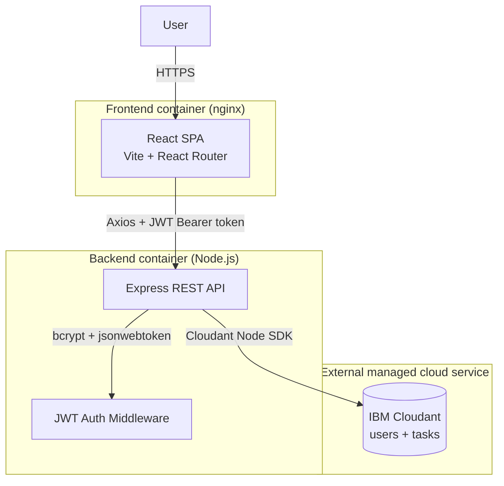
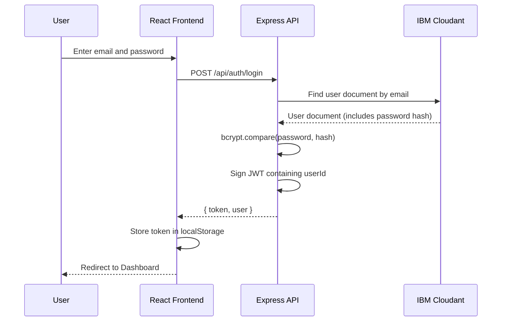
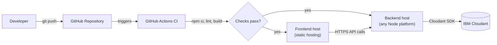

# Cloud-Powered Task Manager

A full-stack task management web app built for students juggling coursework,
projects, and exams — with real accounts, a real cloud database, and a real
REST API behind it, not a browser-only demo.

Built as a portfolio project to practice and demonstrate full-stack and
cloud engineering fundamentals: a React frontend, a Node.js/Express REST
API, JWT authentication with hashed passwords, IBM Cloudant as a managed
NoSQL cloud database, and containerized deployment with CI.

## Why a cloud database?

A task manager that only saves to `localStorage` disappears the moment you
clear your browser or switch devices. This project stores every account and
every task in **IBM Cloudant**, a managed, distributed NoSQL database — the
same category of database used in production systems handling everything
from IoT to e-commerce. Using a real managed cloud service instead of a
local file or in-browser storage means:

- Your tasks persist independently of any one browser or device
- The database handles replication, backups, and availability — not this app
- It's a genuine (if small-scale) example of the client → API → managed
  cloud database pattern used throughout real backend systems

## Features

**Authentication**
- Registration and login with hashed passwords (bcrypt) — plaintext
  passwords are never stored
- JWT-based sessions; every task route is protected and scoped to the
  logged-in user (one user genuinely cannot read, edit, or delete another
  user's tasks, even by guessing a task ID — see [API Documentation](#api-documentation))
- Sessions survive a page refresh

**Task management**
- Create, edit, delete, and mark tasks complete/pending
- Priority (High / Medium / Low) with a clear visual indicator
- Categories: College, Assignment, Project, Exam, Personal, Other
- Optional due dates

**Search, filtering & dashboard**
- Search tasks by title
- Filter by status (All / Today / Upcoming / Completed / Overdue), priority,
  and category
- Dashboard with total/completed/pending/overdue counts, completion
  percentage, a breakdown by category and priority, and quick lists of
  upcoming and overdue tasks

**Engineering**
- REST API with input validation and correct HTTP status codes on every
  route
- Consistent, user-friendly error handling — no raw stack traces or
  database errors reach the frontend
- Responsive design (desktop/tablet/mobile) with accessible touch targets
- Dockerized (frontend + backend), with `docker-compose` to run the whole
  stack locally in one command
- CI via GitHub Actions: lints and builds both frontend and backend on
  every push/PR

## Tech Stack

| Layer | Technology | Why |
|---|---|---|
| Frontend | React (Vite) + React Router + Axios | Fast dev experience, standard SPA routing, clean HTTP client with interceptors for attaching the JWT automatically |
| Backend | Node.js + Express | Minimal, widely understood, easy to reason about and containerize |
| Auth | JWT + bcrypt | Stateless sessions (no server-side session store needed) and industry-standard password hashing |
| Database | IBM Cloudant | Managed, CouchDB-compatible NoSQL document database — a document per task/user, queried with Mango selectors |
| Containers | Docker + docker-compose | Reproducible local environment; the frontend is built and served by nginx, the backend runs directly on Node |
| CI | GitHub Actions | Automated lint + build checks on every push, catching mistakes before they reach `main` |

## Architecture



The frontend never talks to Cloudant directly — only the backend holds
Cloudant credentials, and every task/user document is scoped by `userId`
derived from a verified JWT, never from anything the client sends directly.

### Authentication flow



Every subsequent request from the frontend carries that token as an
`Authorization: Bearer <token>` header. The backend's auth middleware
verifies it and attaches `req.userId` — every task route reads only that,
never a userId supplied by the request itself.

### CI / deployment flow



CI (lint + build) is real and runs automatically. Actual deployment to a
hosting platform is a manual step you'd take from here — see
[Cloud Deployment](#cloud-deployment) below for how, since this repo doesn't
claim to be deployed anywhere right now.

## Project Structure

```
cloud-powered-task-manager/
├── frontend/                  # React app (Vite)
│   ├── src/
│   │   ├── pages/             # Login, Register, Dashboard, Tasks, CreateTask, EditTask, Profile
│   │   ├── components/        # Sidebar, TaskCard, TaskForm, PriorityBadge, ProtectedRoute, AppLayout
│   │   ├── context/           # AuthContext (JWT + user state)
│   │   ├── services/          # api.js (Axios instance), authService.js, taskService.js
│   │   ├── utils/             # taskUtils.js (shared due-date/stat logic)
│   │   └── styles/            # global.css, tokens.css (design system)
│   ├── Dockerfile
│   └── nginx.conf
├── backend/                   # Express REST API
│   ├── controllers/           # authController.js, taskController.js
│   ├── middleware/            # auth.js, errorHandler.js, validateAuth.js, validateTask.js
│   ├── models/                # userModel.js, taskModel.js (Cloudant document shapes)
│   ├── routes/                # authRoutes.js, taskRoutes.js
│   ├── services/               # Cloudant + in-memory-fallback data layers
│   ├── config/                 # env.js, cloudant.js
│   ├── utils/                  # AppError.js, asyncHandler.js, jwt.js
│   ├── server.js
│   └── Dockerfile
├── .github/workflows/ci.yml
├── docker-compose.yml
├── README.md
├── .gitignore
└── LICENSE
```

## Installation (running locally without Docker)

You'll need Node.js 20+ and an IBM Cloud account (free tier) for Cloudant.

```bash
git clone <your-repo-url>
cd cloud-powered-task-manager
```

**Backend:**
```bash
cd backend
npm install
cp .env.example .env
```
Fill in `.env`:
- Generate a JWT secret: `openssl rand -base64 32` → paste as `JWT_SECRET`
- Create a free IBM Cloudant Lite instance and paste its credentials as
  `CLOUDANT_URL` / `CLOUDANT_API_KEY` (see below). Leave both blank to run
  against a temporary in-memory store instead — fine for quick local
  hacking, but the server will loudly warn you and nothing will persist
  across a restart.

```bash
npm run dev
```
The API starts on `http://localhost:5000`.

**Frontend** (in a second terminal):
```bash
cd frontend
npm install
cp .env.example .env
npm run dev
```
Open the URL Vite prints — usually `http://localhost:5173`.

### Setting up IBM Cloudant

1. Create a free account at https://cloud.ibm.com/registration if you don't
   have one.
2. In the IBM Cloud catalog, create a **Cloudant** instance on the free
   **Lite** plan.
3. Open the instance → **Service credentials** → **New credential**. Expand
   it — it contains a `url` and an `apikey`.
4. Paste those into `backend/.env` as `CLOUDANT_URL` and `CLOUDANT_API_KEY`.
   `CLOUDANT_DATABASE` can be any name — the app creates it automatically
   (along with a query index) on first run.
5. Start the backend and watch the logs for `Task storage: IBM Cloudant`
   and `Cloudant: created database "..."`. If credentials are wrong, the
   server logs the real error and exits rather than starting broken.

## Environment Variables

**`backend/.env`** (see `backend/.env.example` — never commit real values):

| Variable | Required | Description |
|---|---|---|
| `PORT` | No (defaults to 5000) | Port the API listens on |
| `NODE_ENV` | No | `development` or `production` |
| `CORS_ORIGIN` | Yes | Must match the frontend's origin, or the browser will block requests |
| `JWT_SECRET` | **Yes** | Random secret used to sign/verify JWTs. Server refuses to start without it |
| `CLOUDANT_URL` | For real persistence | Your Cloudant instance's service URL |
| `CLOUDANT_API_KEY` | For real persistence | Your Cloudant instance's IAM API key |
| `CLOUDANT_DATABASE` | No (defaults to `taskmanager`) | Database name; auto-created if missing |

**`frontend/.env`** (see `frontend/.env.example`):

| Variable | Required | Description |
|---|---|---|
| `VITE_API_URL` | Yes | Base URL of the backend API, e.g. `http://localhost:5000/api` |

## Running with Docker

Requires Docker and Docker Compose. No local Node.js install needed.

```bash
cp backend/.env.example backend/.env
# fill in JWT_SECRET and (optionally) Cloudant credentials
docker-compose up --build
```

- Frontend: `http://localhost:5173` (built with Vite, served by nginx)
- Backend API: `http://localhost:5000/api`

The frontend image is built once into static files rather than running a
dev server in a container. The backend's equivalent of `VITE_API_URL` for
Docker is passed as a build argument (see the comments in
`docker-compose.yml`) since Vite bakes that value in at build time, not
runtime — unlike the backend's environment variables, which are read at
container start via `env_file`.

IBM Cloudant is **not** a container in this setup — it's an external
managed service you already have running in IBM Cloud; the backend
container just needs credentials to reach it over the internet.

## Cloud Deployment

This repo is not currently deployed anywhere — here's how you'd deploy it
yourself:

**Backend** — deploy to any platform that runs a Node.js web service (e.g.
Render, Railway, Fly.io, or IBM Cloud Code Engine using the included
`backend/Dockerfile`):
1. Point the platform at the `backend/` directory (or the Dockerfile).
2. Set `JWT_SECRET`, `CLOUDANT_URL`, `CLOUDANT_API_KEY`, `CLOUDANT_DATABASE`,
   and `NODE_ENV=production` as environment variables in the platform's
   dashboard — never commit them.
3. Set `CORS_ORIGIN` to your deployed frontend's URL once you have it.
4. Most platforms provide `PORT` automatically; the app already reads it
   from the environment.

**Frontend** — deploy to any static host (e.g. Vercel, Netlify, GitHub
Pages, or the included `frontend/Dockerfile` behind any container host):
1. Build command: `npm run build`. Output directory: `dist`.
2. Set `VITE_API_URL` to your deployed backend's URL **at build time** —
   most static hosts let you set build-time environment variables in their
   dashboard.
3. If using a static host that doesn't run your `Dockerfile`, make sure it's
   configured to redirect all paths to `index.html` (see
   `frontend/nginx.conf` for what that looks like) so React Router's
   client-side routes don't 404 on refresh.

**GitHub Actions** already runs lint + build checks on every push — a
natural next step is adding a deploy step to the workflow that runs after
those checks pass, once you've picked a hosting platform and have its
deploy credentials to add as GitHub secrets.

## API Documentation

All endpoints are prefixed with `/api`. All `/tasks` routes require a valid
`Authorization: Bearer <token>` header.

| Method | Endpoint | Auth | Description |
|---|---|---|---|
| GET | `/health` | No | Health check |
| POST | `/auth/register` | No | Create an account. Body: `{ name, email, password }`. Returns `{ token, user }` |
| POST | `/auth/login` | No | Log in. Body: `{ email, password }`. Returns `{ token, user }` |
| GET | `/auth/me` | Yes | Get the logged-in user's info |
| GET | `/tasks` | Yes | List the current user's tasks |
| GET | `/tasks/:id` | Yes | Get a single task (404 if it isn't yours) |
| POST | `/tasks` | Yes | Create a task. Body: `{ title, description?, priority?, category?, dueDate?, status? }` |
| PUT | `/tasks/:id` | Yes | Replace a task's fields |
| PATCH | `/tasks/:id/status` | Yes | Update just the status. Body: `{ status }` |
| DELETE | `/tasks/:id` | Yes | Delete a task |

**Ownership is enforced server-side, not just in the UI.** Every task
lookup is scoped to the requester's `userId` (derived from their verified
JWT). Trying to `GET`, `PUT`, `PATCH`, or `DELETE` another user's task by ID
returns `404 Task not found` — the same response as if the task didn't
exist at all, so an attacker can't even confirm whether a given ID belongs
to someone else.

**Errors** are always JSON: `{ "error": "message" }`, with standard HTTP
status codes (`400` invalid input, `401` missing/invalid auth, `404` not
found, `409` duplicate email, `500` unexpected server error). Database and
stack-trace details are never sent to the client.

## Screenshots

*Not added yet — run the app locally (see Installation above) and add your
own. Suggested shots:*

- Login / Registration page
- Dashboard with real task stats and breakdowns
- Tasks page with filters applied
- Create/Edit Task form
- Mobile view of the Tasks page

Save images under `docs/screenshots/` and reference them here like:
``

## Future Improvements

- Automated tests (Jest/Vitest) for the API and key frontend flows — the
  current CI lint/build checks would gain a real test stage
- Email notifications and task reminders (would need a scheduled job/queue
  and an email provider)
- Role-based access (e.g. shared/team task lists)
- Serverless architecture (e.g. IBM Cloud Functions) for the API instead of
  a long-running Express server
- Advanced analytics (trends over time, streaks, time-to-completion)
- A native mobile app (React Native, sharing the same backend API)

## License

MIT — see [LICENSE](./LICENSE).
